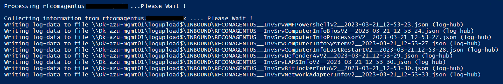
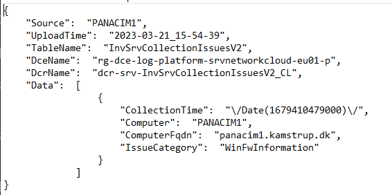
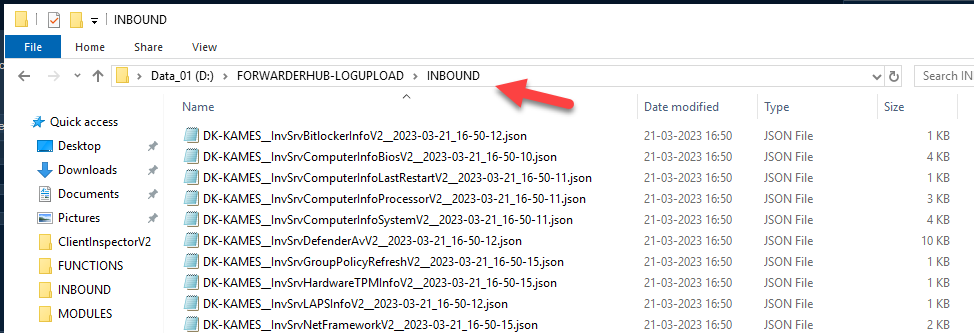
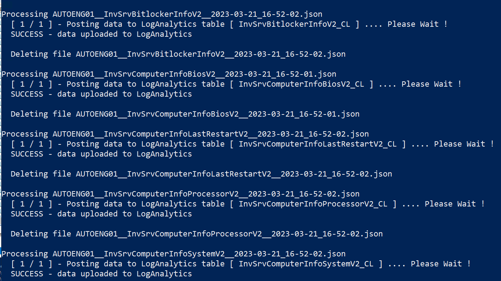

# AzLogDcrIngestPSLogHub
 Solution that acts as an intermediate hub for "no internet connected" endpoints or incompliant endpoints, where you will be sending data using Azure Pipeline/Log Ingestion API

## Flow highlevel

## Detailed flow

### Data collection
Instead of sending to DCE/Azure Pipeline, server sends JSON-file to specific UNC-path (LogHubPath).

### Upload format
Data-format contains the following fields

### Temporary inbound location (max 10 sec)
Files are sent to teporary loghub path and kept there for max 10 sec.

### Upload to Azure
On the Log-hub server, there is a job, which is scanning the LogHubPath for new files (every 10 sec)
It will process the files and send it to the correct DCE – with DCR information – and if succesfully, delete the file.

